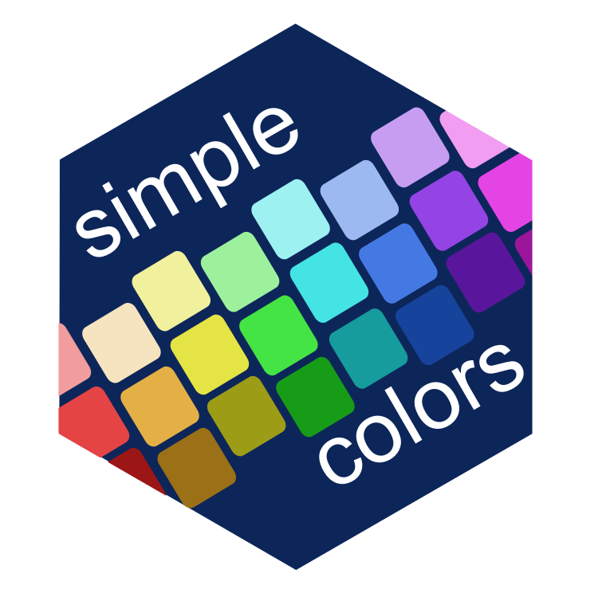

---
output:
  md_document:
    variant: markdown_github
---

<!--  -*- coding: utf-8 -*- -->
<!-- README.md is generated from README.Rmd. Do not edit this file directly -->


```{r, echo = FALSE}
knitr::opts_chunk$set(
  eval = FALSE,
  collapse = TRUE,
  comment = "#>",
  message = FALSE,
  warning = FALSE,
  fig.path = "man/figures/"
)
```

# simplecolors 
<!-- [](https://codecov.io/gh/rjake/simplecolors?branch=master)-->
<!-- badges: start -->
[](https://cran.r-project.org/package=simplecolors)
[](https://cran.r-project.org/package=simplecolors)
  <!-- badges: end -->

simplecolors is designed to generate hex codes using uniformly named colors. 

## Installation
You can install the released version of `simplecolors` from [CRAN](https://cran.r-project.org/package=simplecolors) with:

```{r}
install.packages("simplecolors")
```

You can install the development version from [GitHub](https://github.com/rjake/simplecolors) with:
```{r}
devtools::install_github("rjake/simplecolors")
```

## Usage
The idea is to have a simpler way of accessing color values that is intuitive and easy to remember. Colors can be called using `sc()` or by using the various palette tools `sc_across()`, `sc_blue()`, etc. To see all available colors use `show_colors()`

The colors follow a pattern of `[saturation]` `[color name]` `[lightness]`

More details can be found in  created can be found in [this vignette](https://rjake.github.io/simplecolors/articles/intro.html).


