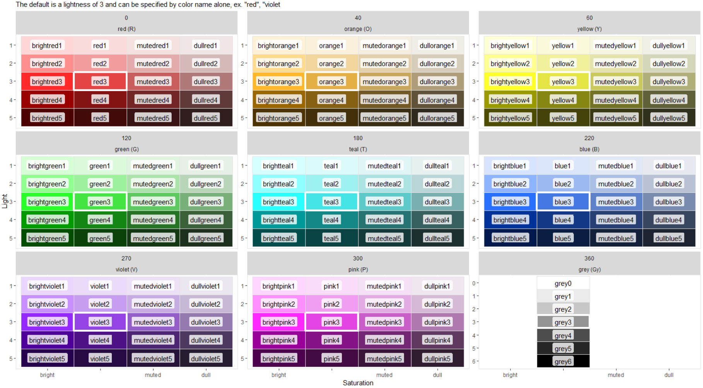

```{r setup, include = FALSE}
knitr::opts_chunk$set(
  message = FALSE,  warning = FALSE,

  fig.height = 2.5,
  fig.width = 5,
  comment = "#>"
)
```


Trying to put colors together in R can difficult. I think most people search google for `ggplot2 colors` and end up looking at some [funky image](http://sape.inf.usi.ch/sites/default/files/ggplot2-colour-names.png) of all the color names that work in R. These colors are from the [X11 colors](https://en.wikipedia.org/wiki/X11_color_names) that were developed in the 1980s. Unfortunately, they have inconsistent names and the lightness/saturation are all over the place. Using `simplecolors` gives you access to a smaller, consistent set of colors. It is similar to the palette tool you might be used to with Microsoft Word or Tableau. You use these colors in the same way you would use `"red"` or `"blue"` to color text or chart elements. Here are the 165 colors that are available


```{r eval=FALSE, echo=FALSE}
p <-
  show_colors() + 
  theme_void() + 
  labs(subtitle = NULL) + 
  facet_wrap(~facet, nrow = 1) +
  theme(strip.text = element_blank()) +
  coord_fixed()

p$layers[[1]]$aes_params$colour <- "black"
p$layers[[2]] <- NULL

p
```

{width=600px}

# The `sc()` function
This function `sc()` stands for **s**imple**c**olors. In base R, you would call the colors you need as `c("green", "blue")`

In `simplecolors` it is very similar but with `sc()` instead `sc("green", "blue")`

The key is that you can add modifiers `sc("brightgreen2", "mutedblue3")`

The naming convention is standardized: there are 4 types of saturation, 8 hues, and 5 levels of lightness plus a greyscale. To use a color, just combine the 3 parts:

|optional saturation|hue       |lightness|
|-------------------|----------|---------|
|bright             |red       |1        |
|""                 |orange    |2        |
|muted              |yellow    |3        |
|dull               |green     |4        |
|                   |teal      |5        |
|                   |blue      |         |
|                   |violet    |         |
|                   |grey      |         |

By default, the outputs are hex codes and `simplecolors` can be used anywhere you can use a hex code. 
```{r, eval=FALSE}
sc("brightgreen2", "mutedblue3")
#> "#8FFF8F" "#5E82C9"
```


For the rest of this tutorial I'm going to show you how to use this package to enhance your color choices in `ggplot2`. First, let's look at the output of base R colors. Although the terms "lightblue" and "navyblue" are common ways to talk about the lightness of blue, when we call them as raw colors they don't have the same "feel" as they go light to dark. 

```{r}
library(ggplot2)
library(simplecolors)

p <- 
  ggplot(mpg, aes(y = drv, fill = drv)) +
  geom_bar() 


p + scale_fill_manual(values = c("lightblue", "blue", "navyblue"))
```

Let's see what it looks like with the `sc()` function
```{r}
p + scale_fill_manual(values = sc("blue2", "blue3", "blue4"))

```

Again, these are just hex codes. The above code is the same as writing 
```{r eval=FALSE}
p + scale_fill_manual(values = c("#9DB9F1", "#4479E4", "#16439C"))
```

# `sc_blue()`, `sc_green()` & friends
Each hue has it's own helper function. Our last example can be simplified using `sc_blue()`

```{r}
p + scale_fill_manual(values = sc_blue(light = 2:4))

```


Like `sc()`, these helper functions returns hex codes
```{r eval=FALSE}
sc_blue(light = 2:4)
#> "#9DB9F1" "#4479E4" "#16439C"
```

and in each of these you can adjust the lightness and saturation 
```{r}
p + scale_fill_manual(values = sc_violet(light = 3:5, sat = "dull"))

```

# `sc_across()`
You can also go across palettes. Let's use base R colors again
```{r}
p + scale_fill_manual(values = c("blue", "purple", "red"))
```

We could call them with `sc()` as `sc("blue", "violet", "red")` but we can also call them with the first letter of each color using `sc_across()`
```{r}
p + scale_fill_manual(values = sc_across("BVR"))
```

We can brighten or dull the saturation with the argument `sat = ...`
```{r}
p + scale_fill_manual(values = sc_across(palette = "BVR", sat = "bright"))
```

and we can lighten or darken with the argument `light = ...`
```{r}
p + scale_fill_manual(values = sc_across(palette = "BVR", light = 4))

```


I tried to keep the first initial for each color unique. For example, I chose "violet" over "purple" so it didn't compete with "pink" but there was no getting around "green" and "grey". For this reason, you must call grey with "Gy"
```{r}
p + scale_fill_manual(values = sc_across(palette = "BGyR"))
```


You can also use the `simplecolors` to make a gradient
```{r fig.height=4}
library(dplyr)

ggplot(mpg, aes(cty, hwy, color = hwy)) +
  geom_count(alpha = 0.8) +
  scale_color_gradient(
    low  = sc("brightorange3"), 
    high = sc("brightviolet3")
  )
```

# Other outputs
For the palettes (`sc_green()`, `sc_across()`, etc.), you can get more info about the colors using the `return = ...` argument.

```{r, fig.align="hold"}
sc_green(return = "plot")
sc_across(palette = "RTVGy", light = 4, sat = "muted", return = "plot")
```

or a table
```{r}
sc_pink(return = "table")
```

# All the colors
At anytime, you can see all of the colors using `show_colors()`
```{r eval=FALSE}
show_colors(labels = TRUE)
```
{width=600px}
